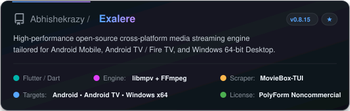
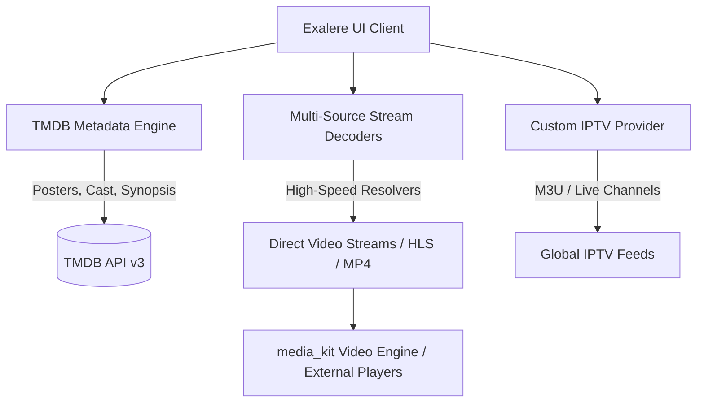

<div align="center">

  

  # Exalere

  ### Next-Generation Cross-Platform Media Hub & Streaming Client

  <p align="center">
    <b>Crafted with Flutter for Android Mobile, Android TV, and Windows Desktop.</b>
  </p>

  <!-- Live Dynamic Shields -->
  <!-- Live Dynamic Shields -->
  <p align="center">
    <a href="https://github.com/Abhishekrazy/Exalere/releases/latest">
      
    </a>
    <a href="https://github.com/Abhishekrazy/Exalere/releases">
      
    </a>
    <a href="https://github.com/Abhishekrazy/Exalere/stargazers">
      
    </a>
    <a href="https://github.com/Abhishekrazy/Exalere/network/members">
      
    </a>
    <a href="LICENSE">
      
    </a>
    <a href="https://github.com/Abhishekrazy/Exalere/actions/workflows/ci.yml">
      
    </a>
  </p>

  <!-- Self-Hosted Dynamic Repository Card -->
  <p align="center">
    <a href="https://github.com/Abhishekrazy/Exalere">
      
    </a>
  </p>

  <!-- Quick Action & Release Buttons Distinct by Platform -->
  <p align="center">
    <a href="https://github.com/Abhishekrazy/Exalere/releases/latest">
      
    </a>
    <a href="https://github.com/Abhishekrazy/Exalere/releases/latest">
      
    </a>
    <a href="https://github.com/Abhishekrazy/Exalere/releases/latest">
      
    </a>
    <a href="https://github.com/Abhishekrazy/Exalere/releases/latest">
      
    </a>
    <a href="https://github.com/Abhishekrazy/Exalere/releases/latest">
      
    </a>
  </p>

  <p align="center">
    <a href="https://abhishekrazy.github.io/Exalere/">
      
    </a>
    <a href="https://github.com/users/Abhishekrazy/projects/3">
      
    </a>
    <a href="https://razorpay.me/@abhishekrazy">
      
    </a>
    <a href="https://komarev.com/ghpvc/?username=Abhishekrazy-Exalere&label=Project+Views&color=0e75b6&style=for-the-badge">
      
    </a>
  </p>

</div>

---

## 📑 Table of Contents

- [Overview](#-overview)
- [Supported Platforms](#-supported-platforms)
- [Key Features](#-key-features)
- [Backend Data & Streaming Architecture](#-backend-data--streaming-architecture)
- [Project Roadmap & GitHub Projects](#-project-roadmap--github-projects)
- [Platform Downloads (TV vs Mobile vs Windows)](#-platform-downloads-tv-vs-mobile-vs-windows)
- [Getting Started & Installation](#-getting-started--installation)
- [Branching Strategy](#-branching-strategy)
- [Contributing & Code of Conduct](#-contributing--code-of-conduct)
- [AI Contributor Rules & Antigravity Skills](#-ai-contributor-rules--antigravity-skills)
- [Top Contributors & Community](#-top-contributors--community)
- [Acknowledgements & Credits](#-acknowledgements--credits)
- [Support & Donate](#-support--donate)
- [License & Non-Commercial Notice](#-license--non-commercial-notice)

---

## 🌟 Overview

**Exalere** is an all-in-one, open-source streaming entertainment hub designed from the ground up to offer a seamless cinematic experience across mobile phones, desktop computers, and TV screens. 

Whether you are browsing trending movies on Windows or leaning back with an Android TV D-Pad remote on your couch, Exalere adapts its typography, focus cues, and controls to give you a fluid, native UI.

---

## 📱 Supported Platforms

| Platform | Support Status | Optimized For | Min Requirements |
| :--- | :---: | :--- | :--- |
| **Android TV / Google TV / Fire TV** | 🟢 Official | D-Pad Remote Focus, 10-foot UI, Leanback Mode | Android 7.0+ (API 24) |
| **Android Mobile & Tablet** | 🟢 Official | Touch gestures, responsive drawers, portrait/landscape | Android 7.0+ (API 24) |
| **Windows Desktop (x64)** | 🟢 Official | Keyboard shortcuts, resizable window, hardware acceleration | Windows 10/11 64-bit |

---

## ✨ Key Features

- 📺 **Native Android TV Support**: Built-in `TvFocusable` components, ambient backdrop changes on hover, D-Pad directional navigation, and on-screen remote-friendly player controls.
- 🎬 **Multi-Source Video Engine**: Powered by `media_kit` (libmpv backend) with hardware video decoding, dual audio tracks, embedded subtitles, and seamless external player handoff (VLC / Just Player).
- 📡 **IPTV & Live Channels**: Stream live TV channels with category filtering and persistent custom M3U playlist storage.
- 🎨 **Adaptive Themes**: Dynamic cinematic palettes, glassmorphism badges, and smooth carousels that render at 60/120 FPS.
- 🗂️ **Personal Library**: Track your watch history, resume playback where you left off, and curate your personalized watchlist.

---

## 🏗️ Backend Data & Streaming Architecture

Exalere combines real-time streaming resolution with structured media metadata:



- **Streaming Scrapers & Host Pools**: Synchronized and powered by [MovieBox-TUI](https://github.com/mesamirh/MovieBox-TUI) for dynamic host pool rotation, HMAC-SHA256 signature generation, and encrypted client tokens.
- **Metadata Services**: Powered by [The Movie Database (TMDB)](https://www.themoviedb.org/) for rich posters, cast listings, release dates, ratings, and plot summaries.
- **Live Broadcast TV**: Powered by [iptv-org/iptv](https://github.com/iptv-org/iptv) for legal, publicly available global broadcast television feeds.
- **Playback Backend**: Powered by [libmpv / media_kit](https://github.com/media-kit/media-kit) for high-performance multi-platform rendering.
- **Redundant Provider Decoders**: Custom plugins and failover scrapers (including 4KHdHub and upcoming SuperEmbed/VidSrc resolvers) orchestrated via `ProviderRegistry`.

---

## 📋 Project Roadmap & GitHub Projects

We track upcoming milestones, sprint tasks, and requested features using the **[Exalere GitHub Project Board](https://github.com/users/Abhishekrazy/projects)**:

- 📌 **Backlog**: Triage and community feature ideas.
  - 🛡️ **Feature Spec / Task**: [IMDb & Parental Guide Age-Rating Filter](docs/tasks/imdb_age_rating_filter_task.md) — Multi-layered community severity analysis, TMDB content ratings, and local caching to filter out explicit/adult titles.
- 🚀 **In Progress**: Active work in the `develop` branch.
- 🧪 **Testing**: Builds undergoing verification in `staging`.
- ✅ **Done**: Merged to `main` and tagged for release.

---

## 📥 Platform Downloads (TV vs Mobile vs Windows)

<p align="center">
  <a href="https://github.com/Abhishekrazy/Exalere/releases/latest">
    
  </a>
  <a href="https://github.com/Abhishekrazy/Exalere/releases">
    
  </a>
  <a href="https://github.com/Abhishekrazy/Exalere/releases/latest">
    
  </a>
</p>

Exalere provides high-performance, lightweight binaries tailored for each environment. All direct download links below dynamically redirect to the **latest release** assets automatically:

| Platform Target | Architecture | Recommended Package | Approx. Size | Direct Download Link | Best For & Description |
| :--- | :---: | :--- | :---: | :---: | :--- |
| 📱 / 📺 **Android TV & Mobile** | `arm64-v8a` | `Exalere-Android-arm64-v8a-<version>.apk` | **~29 MB** | [⬇️ Get ARM64 APK](https://github.com/Abhishekrazy/Exalere/releases/latest) | **Recommended:** Modern Android phones, tablets, Android TV & Google TV (Chromecast with Google TV 4K, Nvidia Shield, Sony Bravia, Xiaomi Mi Box) |
| 🔥 / 📺 **Fire TV & 32-bit TV** | `armeabi-v7a` | `Exalere-Android-armeabi-v7a-<version>.apk` | **~26 MB** | [⬇️ Get ARMv7 APK](https://github.com/Abhishekrazy/Exalere/releases/latest) | Amazon Fire TV Sticks (Lite, 4K, 4K Max, Cube), budget Android TV boxes, and older 32-bit smartphones |
| 💻 **Windows (Setup Installer)** | `x86_64` | `Exalere-Windows-Setup-x64-<version>.exe` | **~26 MB** | [⬇️ Get Windows Setup](https://github.com/Abhishekrazy/Exalere/releases/latest) | Standard Windows 10/11 Installation wizard with Desktop & Start menu shortcuts |
| 💻 **Windows (Portable .zip)** | `x86_64` | `Exalere-Windows-Portable-x64-<version>.zip` | **~36 MB** | [⬇️ Get Windows Portable](https://github.com/Abhishekrazy/Exalere/releases/latest) | Standalone portable 64-bit Windows executable & runtime (no install needed, extract & run) |
| 📦 **Android (Universal)** | `universal` | `Exalere-Android-Universal-<version>.apk` | **~100 MB** | [⬇️ Get Universal APK](https://github.com/Abhishekrazy/Exalere/releases/latest) | All-in-one APK bundling all CPU architectures (use if unsure of device CPU architecture) |
| 🖥️ **Android Emulators** | `x86_64` | `Exalere-Android-x86_64-<version>.apk` | **~31 MB** | [⬇️ Get x86_64 APK](https://github.com/Abhishekrazy/Exalere/releases/latest) | Windows Subsystem for Android (WSA), BlueStacks, and Intel/AMD Chromebooks |

> [!TIP]
> **Which Android package should I choose?**
> - For **Android TV / Google TV / Modern Phones**: Download the **`arm64-v8a`** package (~35 MB) for highest performance and battery efficiency.
> - For **Amazon Fire TV Sticks**: Download the **`armeabi-v7a`** package (~32 MB).
> - If you are unsure: Download the **`Universal`** package (~100 MB).

You can also view all historical versions, release notes, and SHA-256 checksums on our official **[Releases Page](https://github.com/Abhishekrazy/Exalere/releases)**, or try our **[Interactive Web Hub](https://abhishekrazy.github.io/Exalere/)**.

---

## 🛠️ Getting Started (Local Development)

### 1. Clone & Setup
```bash
git clone https://github.com/Abhishekrazy/Exalere.git
cd Exalere
flutter pub get
```

### 2. Run Locally
```bash
# Run on Windows Desktop
flutter run -d windows

# Run on Android Device / TV Emulator
flutter run -d <device_id>
```

### 3. Remote Testing for TV Emulators
When testing on an Android TV emulator without a physical remote, use the included interactive keyboard controller:
```powershell
.\tv_remote.ps1
```

---

## 🌿 Branching Strategy

To keep releases rock-solid, Exalere enforces a structured multi-branch workflow:

- `main`: **Production releases**. Only receives fast-forward merges from `staging` or urgent hotfixes.
- `staging`: **Pre-release & QA**. Used for automated smoke tests and manual testing before launching to `main`.
- `develop`: **Active integration**. All feature branches and community PRs merge here.
- `feature/*` & `bugfix/*`: **Short-lived working branches** branched from and merged back into `develop`.

---

## 🤖 AI Contributor Rules & Antigravity Skills

We embrace contributors using modern AI coding agents (Google Antigravity, Gemini Code Assist, GitHub Copilot, Claude, Cursor). To ensure AI-generated PRs match our architecture, this repository tracks dedicated agent instructions and skills directly in git:

- **Global Rules**: Review [`AGENTS.md`](AGENTS.md) for architectural rules, TV focus requirements, and provider state practices.
- **Reusable Agent Skills**: Check [`.agents/skills/exalere-contributor/`](.agents/skills/exalere-contributor/SKILL.md) for automated runbooks, validation steps, and tests.
- **Verification Rule**: All AI-generated code **must** be validated by the submitter using `flutter analyze` and manual runtime checks before opening a PR.

---

## 🤝 Contributing & Code of Conduct

We love community contributions! Please review our core documents:
- 📖 [Contributing Guidelines](CONTRIBUTING.md)
- 📜 [Code of Conduct](CODE_OF_CONDUCT.md)
- 🔒 [Security Policy](SECURITY.md)

---

## 👥 Top Contributors

Thank you to everyone making Exalere better every day! 

<p align="center">
  <a href="https://github.com/Abhishekrazy/Exalere/graphs/contributors">
    
  </a>
</p>

### Activity & Repository Metrics
<p align="center">
  <a href="https://github.com/Abhishekrazy/Exalere">
    
  </a>
</p>
<p align="center">
  <a href="https://github.com/Abhishekrazy/Exalere/stargazers"></a>
  <a href="https://github.com/Abhishekrazy/Exalere/network/members"></a>
  <a href="https://github.com/Abhishekrazy/Exalere/issues"></a>
  <a href="https://github.com/Abhishekrazy/Exalere/releases"></a>
</p>
<p align="center">
  
</p>

---

## 🙏 Acknowledgements & Credits

Exalere is built with gratitude toward these outstanding open-source projects and communities:

- **[MovieBox-TUI](https://github.com/mesamirh/MovieBox-TUI)** by [@mesamirh](https://github.com/mesamirh): Immense credit and appreciation for reverse-engineering the upstream MovieBox APIs, discovering dynamic host pools, and documenting the HMAC-SHA256 request signing protocol that powers Exalere's primary video scrapers.
- **[iptv-org/iptv](https://github.com/iptv-org/iptv)**: For maintaining an indispensable, clean collection of legal, publicly accessible live TV broadcast streams from around the world.
- **[The Movie Database (TMDB)](https://www.themoviedb.org/)**: For providing the gold standard media metadata, 16:9 episode backdrops, posters, ratings, and cast information.
- **[media_kit](https://github.com/media-kit/media-kit)**: For creating the premier `libmpv`-based video rendering engine for Flutter desktop and mobile.

---

## 💖 Support & Donate

Exalere is completely free and non-commercial. If you love using the application and wish to support ongoing development, hosting costs, and new provider integrations, you can show your support here:

<p align="center">
  <a href="https://razorpay.me/@abhishekrazy" target="_blank">
    
  </a>
</p>

<p align="center">
  💳 <strong>Direct Link:</strong> <a href="https://razorpay.me/@abhishekrazy" target="_blank">https://razorpay.me/@abhishekrazy</a>
</p>

---

## 📜 License & Legal Disclaimers

This project is licensed under the **[PolyForm Noncommercial License 1.0.0](LICENSE)**.

- ✅ **Free for Personal, Community, and Educational Use**: You are welcome to view, run, modify, fork, and contribute back improvements.
- ❌ **Commercial Use Prohibited**: Selling, offering commercial services, or bundling this application/code into monetized products is strictly forbidden.
- ⚖️ **Terms of Use & DMCA Notice**: Please review the [Terms of Use & Content Disclaimer](https://abhishekrazy.github.io/Exalere/terms.html). Exalere does not host, store, or stream media; all content is fetched dynamically from third-party public web providers and TMDB.
- 🔒 **Privacy Policy**: Exalere does not collect telemetry or track personal user data. Read our transparent [Privacy Policy](https://abhishekrazy.github.io/Exalere/privacy.html).

Copyright (c) 2026 Abhishek Razy and Exalere Contributors. All rights reserved.
