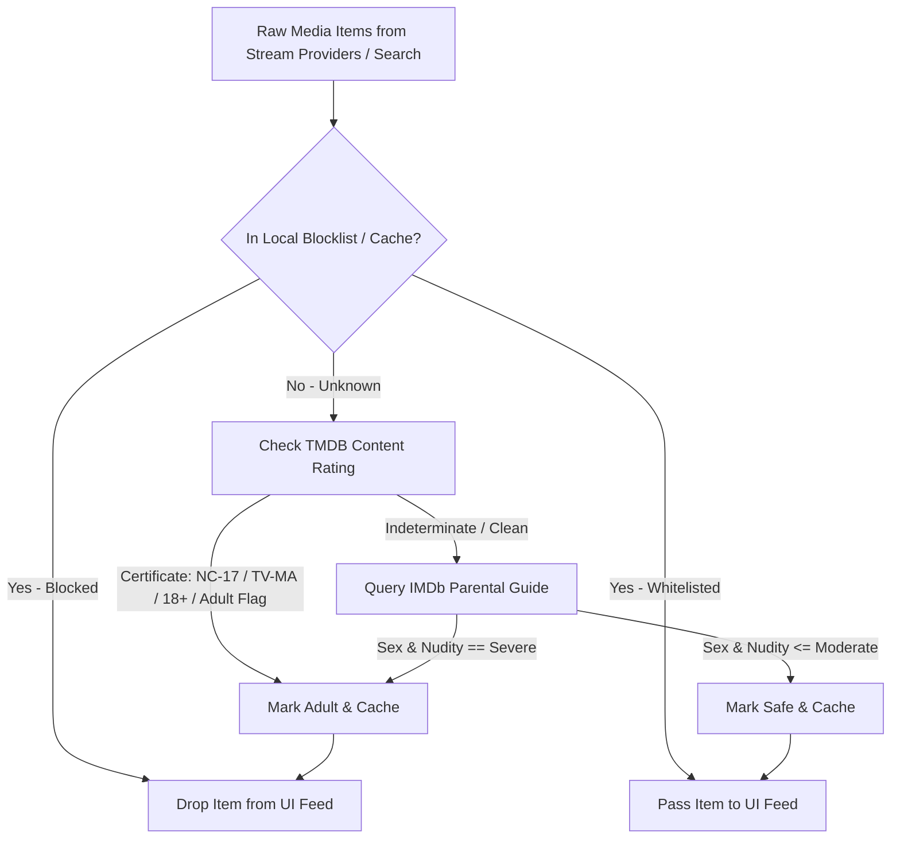

# 🛡️ Project Task: IMDb & Parental Guide Age-Rating Filter Engine

**Task ID**: `TASK-CONTENT-FILTER-001`  
**Status**: 📋 Backlog / Planned for Future Implementation  
**Target Milestone**: v1.2.0 (Enhanced Content Governance & SafeSearch)  
**Assigned To**: Open for pickup  
**License**: PolyForm Noncommercial License 1.0.0  

---

## 📌 1. Executive Summary & Objective

Exalere allows users to stream entertainment across Android TV, Mobile, and Windows Desktop. To maintain a safe, family-friendly media experience, Exalere includes content filtering. However, certain adult/explicit titles (e.g., adult anime OVAs, erotica, and foreign adult films) still occasionally appear in Explore screens or broad search queries.

This task specifies the design, architecture, and implementation for a **multi-layered, native Dart Age-Rating & Parental Advisory Filter Engine**. It leverages official TMDB content certifications, native IMDb Parental Guide advisory data, and an offline local seed cache to reliably filter out adult content with zero reliance on costly external servers or commercial SaaS APIs.

---

## 🔍 2. Root Cause Analysis: Why Titles Slip Through Today

Currently, content filtering relies heavily on:
1. Provider flags (`restrictKid == 1` in MovieBox/upstream responses).
2. Genre keyword checks (`"Erotica"`, `"Adult"`).
3. English title keyword matching (`"porn"`, `"xxx"`, `"hentai"`, etc.).

### Why this fails:
1. **Upstream Catalog Misclassification**: Free/third-party catalogs frequently mislabel adult anime and explicit movies under generic categories such as `"Animation"`, `"Drama"`, or `"Comedy"` with `restrictKid == 0`.
2. **Foreign & Romanized Titles**: Non-English or romanized adult titles (e.g., *Overflow*, *Kuroinu*, *Discipline*, etc.) do not contain explicit English keywords in their names, slipping cleanly past regular expression keyword filters.
3. **Broad Search Query Leakage**: When searching for innocent queries like `"school"`, `"teacher"`, or `"maid"`, the upstream full-text index returns explicit titles alongside mainstream series.

---

## 🧪 3. Analysis of Unofficial IMDb Scrapers

Two unofficial open-source repositories were researched as potential inspirations or integrations:

### 3.1. [madcowGit/imdbscraper](https://github.com/madcowGit/imdbscraper)
- **Overview**: A Dockerized Python Flask microservice created by [@madcowGit](https://github.com/madcowGit) to sync custom IMDb lists and user watchlists into Sonarr/Radarr.
- **Evaluation**:
  - ❌ **Architecture Mismatch**: Cannot be embedded directly into a client-side Flutter application on Android/Fire TV/Windows without bundling Python or running a separate local/remote server container.
  - ❌ **Use-Case Focus**: Tailored toward fetching RSS/JSON lists for torrent/PVR managers rather than on-demand, low-latency parental advisory lookups.
  - ✅ **Useful Takeaways**: Demonstrates efficient extraction of IMDb title IDs (`tt...`) and list traversal patterns.

### 3.2. [omkarcloud/imdb-scraper](https://github.com/omkarcloud/imdb-scraper)
- **Overview**: A hosted commercial/freemium REST API wrapper built by [@omkarcloud](https://github.com/omkarcloud) that provides clean JSON endpoints for IMDb movie details, cast, ratings, and certifications.
- **Evaluation**:
  - ❌ **Rate Limits & API Quotas**: Imposes a 5,000 request/month freemium cap with mandatory API keys. In a distributed open-source app like Exalere, this quota would be exhausted within hours across active installations.
  - ❌ **Privacy & Dependency**: Introducing an external commercial proxy introduces an unnecessary point of failure, latency overhead, and user tracking concerns.
  - ✅ **Useful Takeaways**: Validates the JSON schema structure for IMDb Parental Advisory categories and certificate codes.

---

## 🏛️ 4. Recommended Architectural Solution: Native Dart Hybrid Filter

Rather than relying on third-party SaaS APIs or self-hosted Python containers, Exalere will implement a **lightweight, native Dart Parental Advisory Resolver** directly inside the client application.



### Layer 1: Bundled Offline Seed Blocklist (`assets/data/adult_seed_blocklist.json`)
- A pre-compiled list of known adult studio identifiers, production companies (e.g., Pink Pineapple, PoRow, Bunnywalker), and common adult TMDB/IMDb IDs.
- Evaluated synchronously with **0 ms network overhead** before any UI card is rendered.

### Layer 2: TMDB Content Ratings API (Official & Fast)
- **Movies**: `GET /movie/{movie_id}/release_dates`
  - Inspect certificates across US, GB, and international boards: `NC-17`, `X`, `AO` (Adults Only), `R18+`, or `adult == true`.
- **TV Series**: `GET /tv/{series_id}/content_ratings`
  - Inspect ratings: `TV-MA`, `18`, `R18+`.

### Layer 3: Native IMDb Parental Guide Scraper (`ImdbAdvisoryService`)
IMDb maintains community-voted severity levels for five parental advisory categories:
1. **Sex & Nudity** (`None`, `Mild`, `Moderate`, `Severe`)
2. **Violence & Gore** (`None`, `Mild`, `Moderate`, `Severe`)
3. **Profanity** (`None`, `Mild`, `Moderate`, `Severe`)
4. **Alcohol, Drugs & Smoking** (`None`, `Mild`, `Moderate`, `Severe`)
5. **Frightening & Intense Scenes** (`None`, `Mild`, `Moderate`, `Severe`)

- **Target URL**: `https://www.imdb.com/title/{imdb_id}/parentalguide`
- **Native Dart Scraping**:
  - Request with standard desktop/mobile user-agent headers.
  - Parse the severity status using either `html` package (`package:html/parser.dart`) or regex on the section container:
    ```dart
    // Example target selector:
    // section#advisory-nudity span.ipl-status-pill
    ```
  - **Rule**: If `Sex & Nudity` is rated **`Severe`**, the title is unconditionally classified as adult and blocked when Parental Controls are active.

### Layer 4: Persistent Disk Cache (`adult_filter_cache.json` / SQLite)
- Query results are stored locally via `SharedPreferences` or a lightweight JSON cache in the app support directory.
- Once a title is evaluated as safe or adult, it is never queried over the network again.

---

## 🛠️ 5. Implementation Roadmap & Steps

### Phase 1: Offline Seed List & Data Model
- [ ] Create `assets/data/adult_seed_blocklist.json` containing known adult studio keywords and TMDB IDs.
- [ ] Register asset in `pubspec.yaml`.
- [ ] Create `lib/models/content_rating.dart`:
  ```dart
  class ParentalAdvisory {
    final String tmdbId;
    final String? imdbId;
    final String? certification;
    final String? nuditySeverity; // 'none', 'mild', 'moderate', 'severe'
    final bool isAdult;

    const ParentalAdvisory({
      required this.tmdbId,
      this.imdbId,
      this.certification,
      this.nuditySeverity,
      required this.isAdult,
    });
  }
  ```

### Phase 2: Native Service Implementation
- [ ] Create `lib/services/adult_filter_service.dart`:
  - `Future<bool> isAdultContent(MediaItem item)`
  - `Future<List<MediaItem>> filterMediaList(List<MediaItem> items)`
  - Load offline seed list on startup.
  - Cache hits to disk with TTL.
- [ ] Implement IMDb Parental Guide crawler using `http` and `package:html`.

### Phase 3: UI & Settings Integration
- [ ] Add settings toggle in `lib/ui/screens/settings_screen.dart`:
  - **"Strict Family Mode"** (Filter out R, NC-17, and Severe Nudity).
  - **"Standard SafeSearch"** (Filter out NC-17, Adult Only, and Severe Nudity) — *Default*.
  - **"Off"** (Disable all filtering).
- [ ] Wire `AdultFilterService` into `MovieBoxProvider` and `ExploreScreen` grid loaders.

### Phase 4: Testing & Verification
- [ ] Write unit tests verifying that adult titles with romanized names are blocked by the seed list.
- [ ] Write unit tests verifying that mainstream titles (e.g., *Inception*, *Breaking Bad*, *Demon Slayer*) are permitted.
- [ ] Verify D-Pad navigation and smooth rendering in `ExploreScreen` on Android TV without UI stutter.

---

## 📄 6. Credits & Acknowledgements

Special appreciation to the authors of the following projects for researching and open-sourcing IMDb scraping patterns:
- **[madcowGit/imdbscraper](https://github.com/madcowGit/imdbscraper)** by [@madcowGit](https://github.com/madcowGit): For watchlist ingestion and IMDb ID traversal techniques.
- **[omkarcloud/imdb-scraper](https://github.com/omkarcloud/imdb-scraper)** by [@omkarcloud](https://github.com/omkarcloud): For JSON advisory schema concepts and certification mappings.
